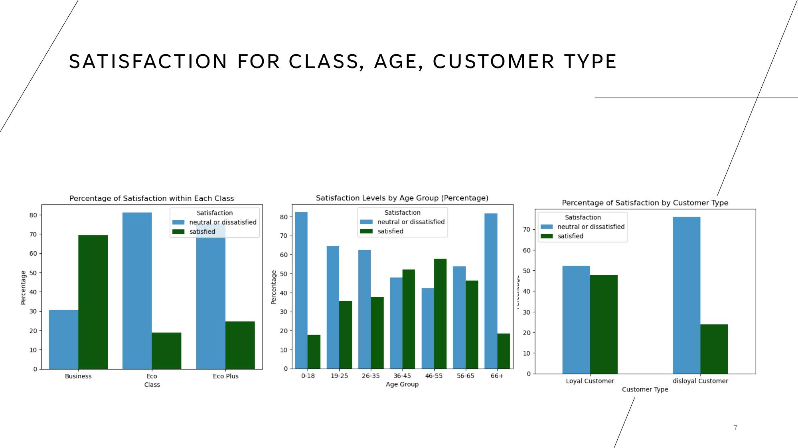
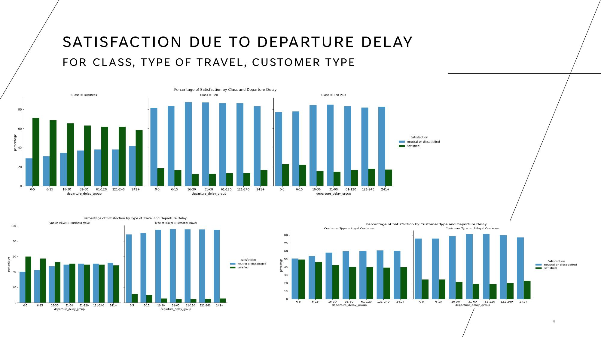
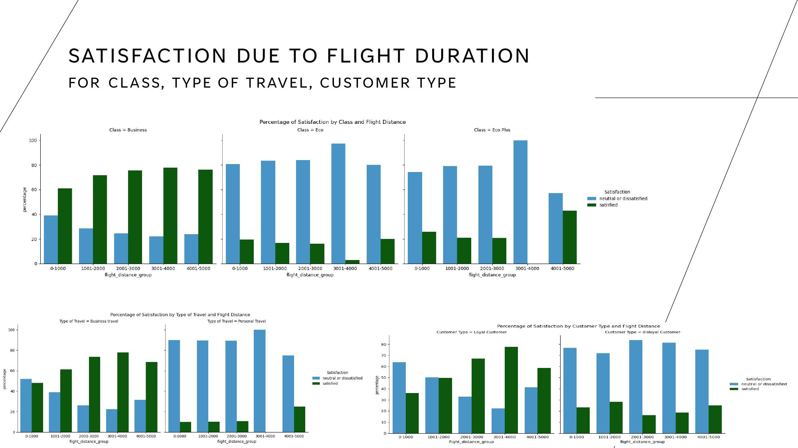
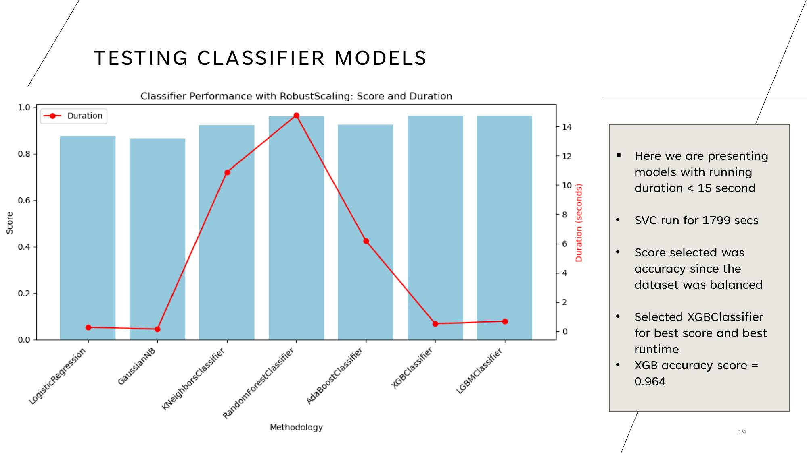
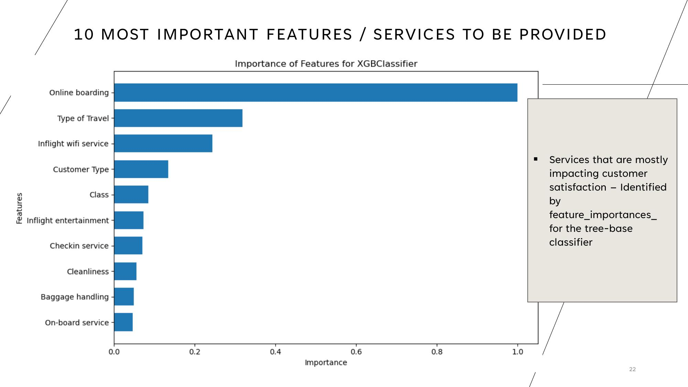
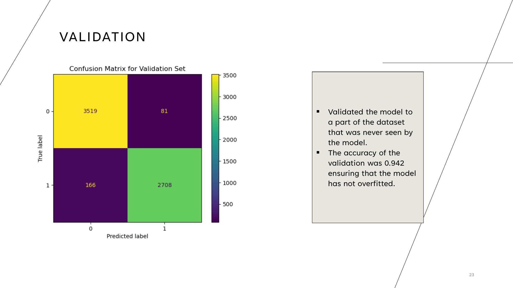

# Airline Passenger Satisfaction: Classification & Key Driver Analysis

A supervised machine learning project identifying which factors most influence whether an airline passenger reports satisfaction — and building a classifier accurate enough to predict it for individual, previously unseen customers.

**Project:** Big Blue Data Academy, Data Science Bootcamp · **Duration:** 1 day

## Business Case

Two questions, both actionable for an airline's customer experience team:
1. **Can we predict** whether a given passenger will be satisfied, based on their trip and service experience?
2. **What actually drives that satisfaction** — which specific services should the business prioritize improving?

## Dataset

[Airline Passenger Satisfaction (Kaggle)](https://www.kaggle.com/datasets/teejmahal20/airline-passenger-satisfaction/data) — 129,880 rows, 24 features, split between descriptive attributes (age, travel class, flight distance, delays) and 0–5 satisfaction ratings across 14 individual services (wifi, boarding, seat comfort, cleanliness, and more).

## Exploratory Data Analysis

- The dataset is well-balanced: roughly even gender split, 80% loyal customers, 70% business travel, and a roughly even satisfied/dissatisfied split overall
- **Business class passengers are satisfied by a wide margin (~70%)**; Eco and Eco Plus passengers are overwhelmingly dissatisfied (~80%) — the single clearest satisfaction driver in the dataset
- **Loyal customers split evenly** between satisfied and dissatisfied, while **disloyal customers are overwhelmingly dissatisfied** — suggesting dissatisfaction is likely a cause of disloyalty, not just a correlate
- **Middle-aged passengers (36–55) are the most satisfied age group**; both the youngest (0–18) and oldest (66+) groups skew heavily dissatisfied
- Delay length and flight duration have only a modest relationship with satisfaction, and travel class dominates both:

  Business class stays majority-satisfied at every delay length, from 0–5 minutes up to 241+ minutes; Eco and Eco Plus stay overwhelmingly dissatisfied (~80%+) at every delay length too. The class itself, not the delay, is driving the outcome.

  The same pattern holds for flight duration — and Business class satisfaction actually *increases* with longer flights (from ~60% at under 1,000 miles to ~78% at 3,000–4,000 miles), while Eco/Eco Plus stay dissatisfied across every distance band. The *service experience itself*, not operational friction, appears to be the dominant factor.

## Data Preparation

- **Missing values:** ~300 rows with NaNs dropped from ~123K total — negligible impact
- **Collinearity check:** `Arrival Delay` and `Departure Delay` were correlated at >0.96; kept `Arrival Delay` and dropped `Departure Delay`, reasoning that arrival timing has a more direct business impact (missed connections, meetings) than departure timing alone
- **Feature engineering:** created a binary `Delayed` flag (0/1) to address extreme skew in the raw delay-minutes columns (56% of flights had zero delay)
- **Encoding:** binary categoricals converted directly (Gender, Customer Type, Type of Travel); `Class` ordinally encoded (Eco < Eco Plus < Business) rather than one-hot, preserving its natural ordering
- **Scaling:** tested MinMax, Standard, and Power transformers alongside RobustScaler — RobustScaler was selected specifically because visible outliers in the service-rating features were judged legitimate (real passenger experiences), not data errors worth removing
- **Outliers:** deliberately *not* dropped — a business judgment call that extreme-but-real values (e.g., very long delays) are meaningful cases to keep, not noise to discard

## Model Selection

Nine classifiers were benchmarked on accuracy *and* training time — a deliberately practical lens, since a marginal accuracy gain isn't worth a 100x runtime cost in most real deployment contexts:

| Model | Accuracy | AUC |
|---|:---:|:---:|
| Logistic Regression | 0.877 | 0.928 |
| Gaussian Naive Bayes | 0.865 | 0.923 |
| KNeighbors | 0.922 | 0.965 |
| Random Forest | 0.961 | 0.994 |
| AdaBoost | 0.926 | 0.978 |
| **XGBoost** | **0.964** | **0.995** |
| **LightGBM** | 0.963 | 0.995 |
| SVC | 0.940 | 0.983 |

**SVC took 1,799 seconds to train** — by far the slowest — while **XGBoost matched or beat every other model's accuracy in under 15 seconds**. XGBoost was selected as the final model on that combined accuracy/runtime basis, with accuracy chosen as the primary scoring metric specifically because the dataset's satisfied/dissatisfied classes were well-balanced (making accuracy a trustworthy metric, rather than misleading as it can be on imbalanced data).

## What Actually Drives Satisfaction

Feature importance was extracted directly from the tree-based model (`feature_importances_`), cross-checked against `SelectKBest` univariate scoring as a sanity check. **`Online boarding` dominates every other feature by a wide margin**, followed by `Type of Travel`, `Inflight wifi service`, and `Customer Type`.

**A practical efficiency finding:** re-training XGBoost using only the top 10 features (half the original feature count) achieved 95.7% accuracy — within a point of the full 23-feature model's 96.4%. For a production system, that's a meaningful trade-off worth knowing about: most of the predictive power is concentrated in a small, interpretable set of service touchpoints.

## Validation

The final model was tested against a validation set it had never seen during training, achieving **94.2% accuracy** — close enough to the training/test performance to confirm the model generalizes well rather than overfitting. Predictions were also mapped back to individual `CustomerID`s, demonstrating the model works at the level an actual business application would need: flagging specific at-risk customers, not just aggregate statistics.

## Key Takeaways

1. **Online boarding experience is, by a wide margin, the single strongest predictor of overall satisfaction** — ahead of seat comfort, cleanliness, or even wifi
2. **Travel class matters enormously**: Business class passengers are satisfied regardless of delays or flight duration; Economy passengers are dissatisfied regardless of those same factors — the service tier itself is doing most of the work
3. **A well-chosen model (XGBoost) delivered both the best accuracy and by far the best speed** — a reminder that "biggest model" and "best model" aren't the same thing
4. **Half the features achieved nearly the same accuracy**, a genuinely useful finding for any team thinking about what data is actually worth collecting

## Data & Tools

- **Language:** Python
- **Data manipulation:** pandas, NumPy
- **Preprocessing:** scikit-learn (RobustScaler, OrdinalEncoder, SelectKBest)
- **Models benchmarked:** Logistic Regression, Gaussian Naive Bayes, SVC, KNeighbors, Random Forest, Gradient Boosting, AdaBoost, XGBoost, LightGBM
- **Explainability:** XGBoost `feature_importances_`, cross-validated against SelectKBest
- **Visualization:** matplotlib, seaborn

## Files in This Repository

| File | Description |
|---|---|
| `ProjectSupervised_EDA.ipynb` | Exploratory data analysis: distributions, satisfaction breakdowns by class/age/customer type/delay/duration |
| `ProjectSupervised_MODELS.ipynb` | Data preparation, 9-model benchmark, feature selection, final model training and validation |
| `AIrline_Customer_Satisfaction_Project.pdf` | Presentation summarizing findings and business recommendations |

## Participants

- Katerina Psallida
