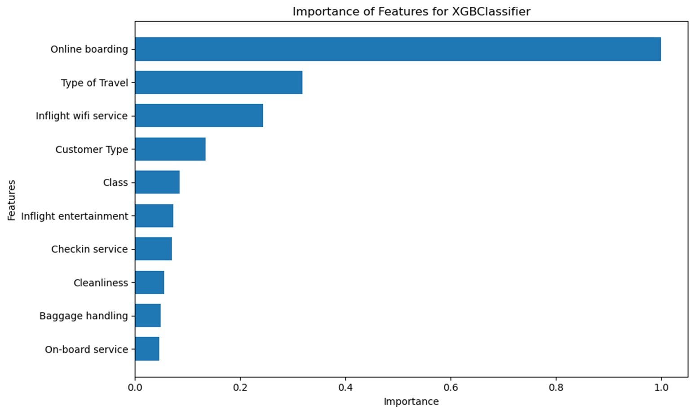

# Identifying the factors that affect customer satisfaction for an airline company

---

**URL**: [https://www.kaggle.com/datasets/teejmahal20/airline-passenger-satisfaction/data]

---

- Find according to specific criteria whether a customer will be satisfied by the aviation company services 
or not.  
- Additionally, identify the factors that are affecting most the customers' satisfaction

This project is associated with the Big Blue Data Science Bootcamp - April 2024. Duration: 1 day.

## Project Organization
```
├── README.md   <- The top-level README for navigating this project

├── data        <- The original data from Kaggle

├── notebook    <- Jupyter notebooks. EDA Notebook and MODEL training Notebook

├── presentation <- Presentation with findings

```

## A sneak peak of the factors affecting Customer Satisfaction

Here is the importance of features for predicting customer satisfaction:


## Participants

- Katerina Psallida
